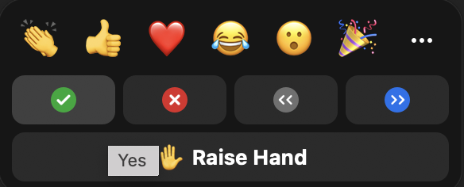

```{r setup, include=FALSE}
knitr::opts_chunk$set(echo = TRUE)
library(tidyverse)
```

## To get this RMarkdown document: 

To download to your local RStudio, open or be inside your R project from last week. 

If you don't have a project from last week, follow these instructions to create a new project. 

1. Under the File menu, click on New project, choose New directory, then New project
2. Enter the name library_carpentry for this new folder (or “directory”). This will be your working directory for the rest of the day.
3. Click on Create project

Now, run the `download.file` function we used last week, with the URL's to the files we will use in the workshop. 

```{r rmd-notebook, eval=FALSE}
download.file('https://raw.githubusercontent.com/ucla-data-archive/lc-r_week2/main/week2-intro-r.Rmd', 'week2-intro-r.Rmd')
download.file('https://raw.githubusercontent.com/ucla-data-archive/lc-r_week2/main/exercises.Rmd', 'exercises.Rmd')
```


## Let us know if you see those in your Files pane in RStudio? 

* Use the Zoom `yes` feature



Open this file `week2-intro-r.Rmd` file by clicking on them in the Files pane. 

You will use this document to follow along with me and "live code". We will create code chunks for our R code. This will be fun! 

We will use the Rmd document `exercies.Rmd` when we go into breakout room to solve challenges. 

But first ... 

## What is RMarkdown? 

* A document type in R that lets you intersperse text, R code, images and the output of our code (this includes visualizations).
* We use the `knit` button aboveto compile this document and it will then be rendred into either a webpage, a pdf, a word document.

This will turn into an in-line image: 


Let's try this. Scroll up and change my name to yours, save and press `knit`.

## Last week brief review using RMarkdown

* At the end of the class we used a cleaned up version of the raw `books.csv` that was derived from the University of Houston–Clear Lake Integrated Library System in 2018.
* It is a sample of books from the catalog. 
* It consists of 10,000 observations of 11 variables. 
* We read in this data from a url like so: 

```{r books2}
books2 <- read_csv("https://raw.githubusercontent.com/LibraryCarpentry/lc-r/main/data/books_reformatted.csv")
```

We looked at the data using `glimpse`. 

```{r glimps-books}
glimpse(books2)
```

We created a subset of the data retaining only books that are in the "general collection", "juvenile" and "k12 materials" sub-collections. 

```{r subset-books-subcol}
books_plot <- books2 %>% 
  filter(subCollection == "general collection" |
         subCollection == "juvenile" |
         subCollection == "k12 materials",
         !is.na(call_class))
```

We then plotted the data using ggplot: 

```{r bar-call-class}
ggplot(data = books_plot, mapping = aes(x = call_class)) + geom_bar()
```

## This week's schedule 

How to make a table in markdown 

| Topic | Time |
| ------- | ----- | 
| Introduction to RMarkdown documents & review | 9:10 am -9:30 am |
| Cleaning and preparing data in R | 9:30 am - 10:15 am | 
| Challenges | 10:15 - 10:30 am |
| Break | 10:30 - 10:40 am |
| Visualizing data in R | 10:40 am - 11:50 |
| Break | 11:50-noon | 
| Challenges | 12:00 - 12:20  | 
| Feedback & Questions | 12:20-12:30 |
| End | 12:30 | 

## Data Cleaning & Transformation 


